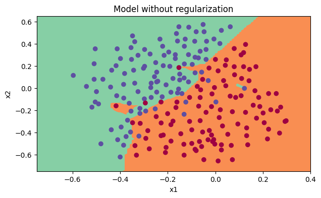
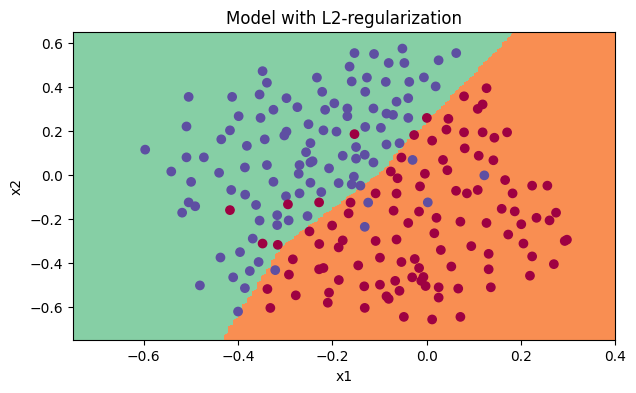
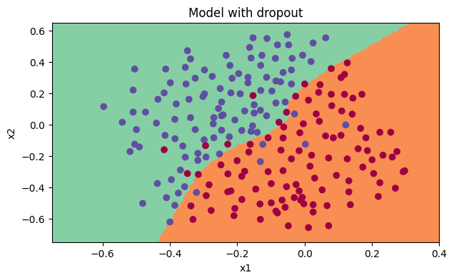

# French Prediction from Scratch 🇫🇷

This project implements a simple **French word prediction / classification model** entirely from scratch using **Python** and **NumPy**.  
No external neural network frameworks (like TensorFlow or PyTorch) are used — everything is coded manually step by step.  

---

## ✨ Features
- Implemented forward propagation, backpropagation, regularization, and dropout **from scratch**.  
- Works on a **2D toy dataset** for demonstration.  
- Visualizes **decision boundaries** and training cost.  
- Educational: a great way to learn how neural networks actually work under the hood.  

---

## 📂 Project Structure
```
french_prediction/
│── model.ipynb       # Main notebook (training & evaluation)
│── helper.py         # Helper functions (activations, forward/backward propagation, etc.)
│── datasets/
│    └── data.mat     # Training dataset
│── requirements.txt  # Python dependencies
│── README.md         # Project documentation
```

---

## 🚀 Getting Started

### 1. Clone the repo
```bash
git clone https://github.com/<username>/french-prediction.git
cd french-prediction
```

### 2. Install dependencies
```bash
pip install -r requirements.txt
```

### 3. Open Jupyter Notebook
```bash
jupyter notebook
```

Then open **`model.ipynb`** and run the cells step by step.  

---

## 📖 Requirements
- Python 3.9+  
- NumPy  
- Matplotlib  
- h5py  
- SciPy  
- scikit-learn  
- Jupyter Notebook  

Install all with:
```bash
pip install -r requirements.txt
```

---

## 🧠 How it Works
1. Load dataset from `datasets/data.mat`.  
2. Initialize parameters for a small neural network (3 layers).  
3. Perform **forward propagation** to compute predictions.  
4. Compute loss using **cross-entropy**.  
5. Perform **backpropagation** to compute gradients.  
6. Update parameters with **gradient descent**.  
7. Add **L2 regularization** or **dropout** to improve generalization.  
8. Plot **decision boundary** and evaluate accuracy.  

---

## 📊 Example Results

During training, the model learns decision boundaries for the dataset. Below are visualizations from the notebook:

### Model without Regularization


### Model with L2 Regularization


### Model with Dropout


---

## 🤝 Contributing
Pull requests are welcome. If you’d like to extend this project (e.g., train on a larger dataset or add new features), feel free to contribute.  

---

## 📜 License
This project is licensed under the MIT License. 